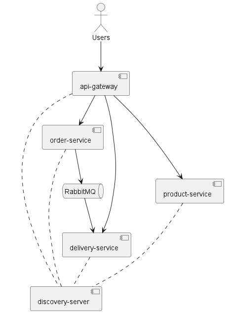

# aw08

Please extend your MicroPOS system by adding a delivery service shown as the following figure (it's not necessary that your MicroPOS system has a same layout of microservices as in this figure).

When an order is placed by a user, the order serivce sends out an event into some AMQP MOM (such as RabbitMQ). The delivery service will be notified and a new delivery entry will be generated automatically. User can query the delivery status for his orders.

Use [Spring Cloud Stream](https://spring.io/projects/spring-cloud-stream) to make the scenerio happen. You can refer to the [guide project](https://github.com/spring-guides/gs-spring-cloud-stream) for technical details.

# 系统介绍

系统结构如图，包含了五个微服务，其中两个分别为网关服务和注册中心服务，负责路由和服务注册、发现。 另外三个分别是订单服务、配送服务和产品服务。
订单服务负责处理用户下单的请求，在接到新的订单后，会通过消息队列通知配送服务，同时返回给用户一个订单id，用户可以通过该订单id向配送服务查询订单状态。
为实现简单，未连接到数据库，订单服务和配送服务的数据都是存储在内存中的。
