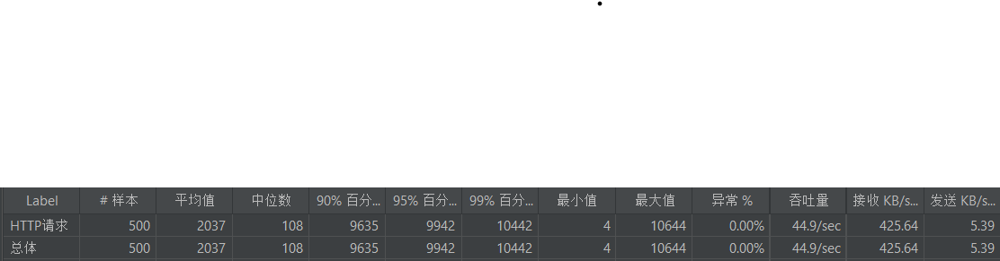
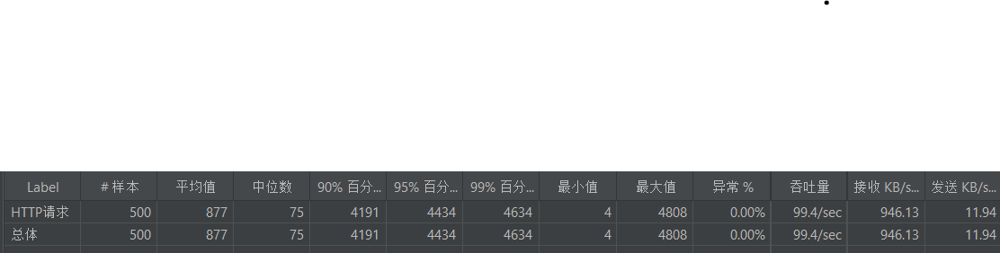
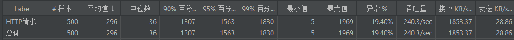
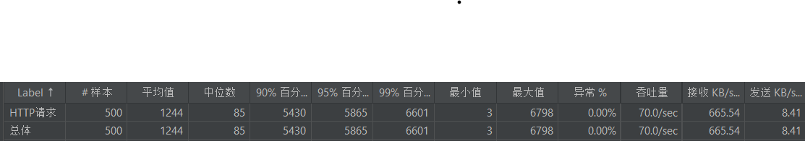
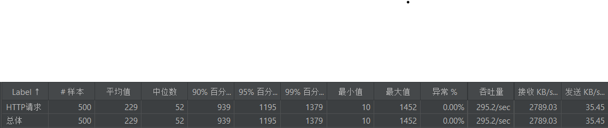

# 压力测试报告

本次压力测试选择了`Jmeter`工具进行测试，测试的目标是`/product`接口。
使用`Jmeter`工具模拟100个用户同时访问`/product`接口，每个用户访问5次。

## 测试结果

### 1. 垂直扩展

使用`docker`来控制容器的资源，对容器进行垂直扩展，分别测试了cpu=2、cpu=4、cpu=8的情况。

- cpu=2的情况下，测试结果如下：
  
- cpu=4的情况下，测试结果如下：
  
- cpu=8的情况下，测试结果如下：
  

可以发现，随着cpu的增加，吞吐量和响应时间都有所提升，且提升与cpu的增加成正比。

### 2. 水平扩展

启动4个容器，每个容器的cpu=1，使用`Haproxy`进行负载均衡，测试结果如下：

可以发现，这个集群的性能在cpu=2和cpu=4之间，并没有达到cpu=4的性能。

### 3.缓存

使用`Redis`集群作为缓存，测试结果如下：

注：本次测试未使用`docker`来控制资源，因为网络比较复杂，不太清楚，所以在本地测试的。
