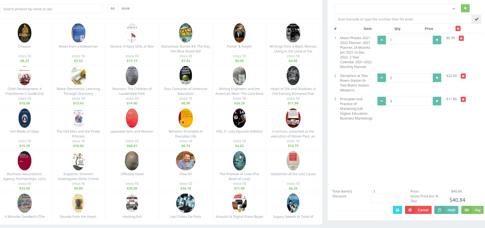
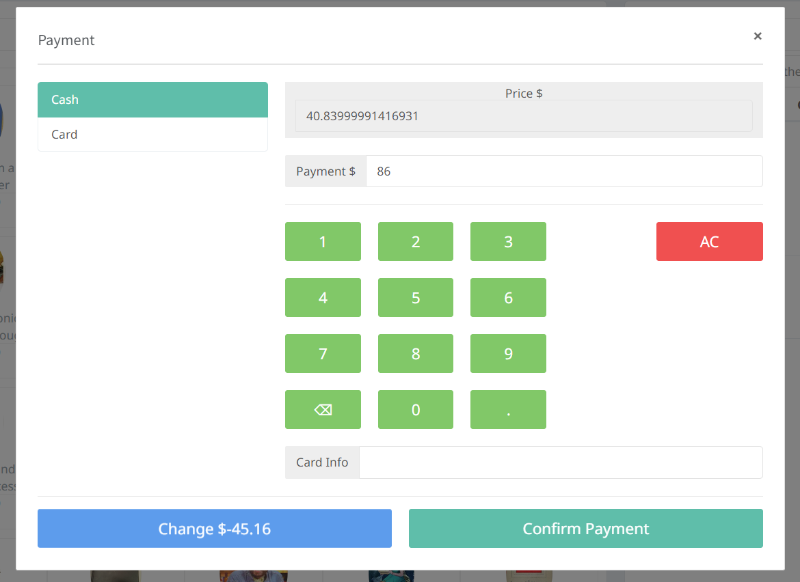
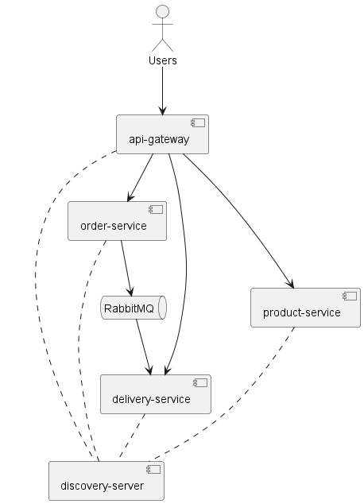
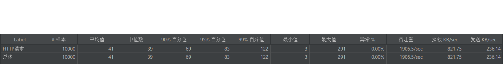

[](https://classroom.github.com/a/OGBkptCL)
# aw09-final

Please develop a **fully functional** online purchase order system.

- It should have a superb collection of goods merchandises
- Customer can browse/search for merchandises, add selected one into his shopping cart and checkout to complete a transaction.
- User can get delivery status updates continuously.

The system should be of a **reactive architecture** based on Spring Webflux. And the system should be 

-  Responsive: it should response to the user request timely.
-  Resilient: it should not be easily broken down.
-  Elastic: it should be flexible to scale out.
-  Message Driven: it should has loosely coupled components that communicates with each other asynchronously.


Please design tests/experiements to demostrate that your system fulfills such requirements as stated in [The Reactive Manifesto](https://www.reactivemanifesto.org)

**Submit your codes/documentation/tests/experiements of your system**

**Please write an article titled "My Perspective on Software Architecture" (the length and quality of the article will determine your score).**

`test.jmx`为实验测试文件，使用`Jmeter`进行压力测试。

`report.pdf`为软件架构文章。

# 实验报告

由于不太熟悉前端，故部分功能只实现了后端接口，暂无前端代码。

## 系统实现功能

### 商品种类丰富

通过前面的数据获取，我们数据库中已经含有了丰富的商品，如下图所示：


### 购物车与结账

用户可以通过点击商品的购买按钮将商品加入购物车，如下图所示：



用户可以在购物完成后点击结账按钮，系统会自动计算总价，如下图所示：



### 订单系统

购物完成后，会发送一个订单到服务器，之后订单信息会通过消息队列发送的运送系统：

```java

@PostMapping("/order")
public Mono<String> postOrder(@ModelAttribute OrderDto orderDto) {
    Order order =
            new Order(UUID.randomUUID().toString(), orderDto.getProductId(), orderDto.getCount());

    streamBridge.send("order-out-0", order.getId());

    return Mono.just(order.getId());
}
```

运送系统会将订单信息及其状态变化存储到数据库中，之后前端会定期获取订单状态，
从而获取订单的状态变化。

### 搜索功能

搜索只实现了后端接口，用户可以通过输入商品名称来搜索商品，会使用模糊搜索的方式来搜索商品。
后端接口如下：

```java

@GetMapping("/product/search/{name}")
public Flux<Product> search(@PathVariable("name") String name) {
    return databaseClient
            .sql("SELECT * FROM product WHERE title LIKE :name LIMIT 60")
            .bind("name", "%" + name + "%")
            .mapProperties(ProductDao.class)
            .all()
            .map(productMapper::toProduct);
}
```

## 系统设计

### 系统架构

系统架构与上一次作业相同，没有改变，如下图所示：



### 响应式实现

修改了访问数据库的框架，之前使用`mybatis`，现在使用`r2dbc`，首先需要在`application.properties`中配置数据库连接：

```yaml
spring:
  r2dbc:
    url: r2dbc:mysql://localhost:3306/data
    username: root
    password: 123456
    pool:
      initial-size: 10
      max-size: 20
```

之后在对应的`service`中使用`r2dbc`的`databaseClient`来访问数据库，示例如下：

```java
public Flux<Product> getAll() {
    return databaseClient
            .sql("SELECT * FROM product")
            .mapProperties(ProductDao.class)
            .all()
            .map(productMapper::toProduct);
}
```

## 实验测试

使用`Jmeter`进行压力测试，测试了获取商品的`/product/{id}`接口，在随机id的情况下，
测试结果如下：



可以发现系统在高并发下仍然能够正常运行，并且拥有较好的性能。

当设置所有请求都为同一个id时，发现出现了较多的错误，原因应该是数据库无法承受如此高的并发请求。
可通过增加缓存来解决这个问题。

## 反应式宣言

### Responsive

通过上述实验可以发现后，系统能够在高并发下仍然能够正常运行，响应时间较短。

### Resilient

系统在高并发下仍然能够正常运行，但是在极端情况下可能会出现错误，如数据库无法承受如此高的并发请求。
但是这种故障并不会导致系统崩溃，只会导致部分请求失败。

### Elastic

系统使用了微服务架构，可以很容易的扩展系统，只需要增加新的服务即可。

### Message Driven

系统使用了消息队列，可以很好的解耦各个服务，使得系统更加灵活。
同时，注册中心的存在也一定程度上解耦了服务。